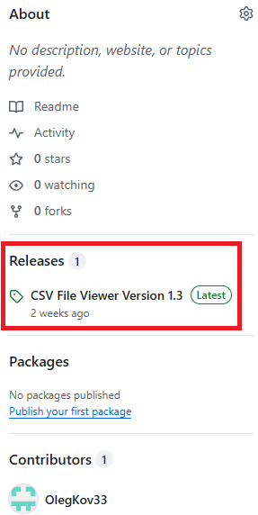
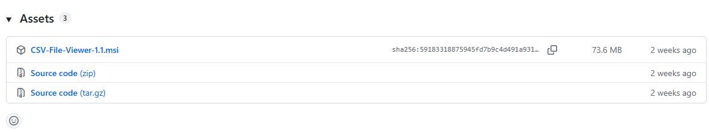
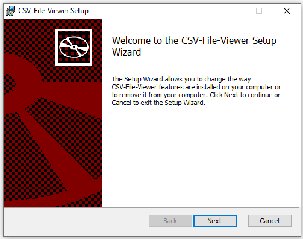
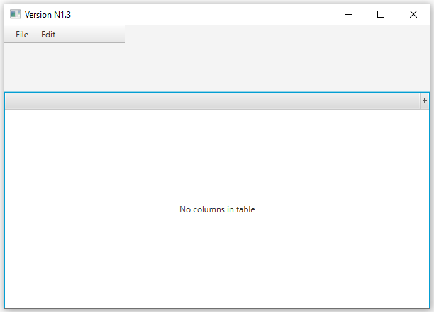
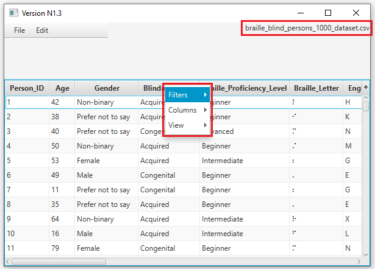
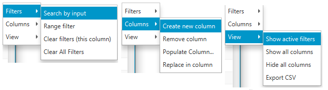

# CSV-File-Viewer-new

This is a file viewer made in Java with the JavaFX graphical interface library.

> [!Note]
> There is no code available yet, as the project isn't fully finished, but ready enough to be used for some features.

## Instructions to install
In order to try it out for yourself, you first need to install it. Currently, the program is available only for Windows users.
1. Navigate to the Releases tab under the About tab on the right-hand side and select the latest version
   
2. If you are unable to see the bar, you can instead press [here](https://github.com/OlegKov33/CSV-File-Viewer-new/releases/tag/CSVFileViewer)
3. Once you are on the page, scroll down until you see the Assets section, and then press CSV-File-Viewer-1.1.msi option for Windows. Linux and Mac versions are not there yet. 
4. If you are unable to see or interact with it, press [here](https://github.com/OlegKov33/CSV-File-Viewer-new/releases/download/CSVFileViewer/CSV-File-Viewer-1.1.msi) to install the Windows version
5. Once you have installed it, open up the Wizard, and you should see this window 
6. Congratulations, you have installed a CSV File Viewer

## Showcase
Once you open the file viewer, you will be met with the following window with practically nothing. 
After you have found a file you wish to view and upload it, you will be met with the following changes;
1. You will now have options in the edit menu near the file at the top
2. You will see the file name in the top right corner
3. You will have data in columns, each column, you can press with the right click of a mouse and get a special menu

Once you have opened a column choice menu, you may find and interact with the following;
1. Filter:
   1. Search by input: Enter anything, and the program will show you all key-sensitive options for that input
   2. Range filter: Similar to prior. However, here you can filter number ranges or for text, the number of characters
   3. Clear filters: Removes filters for the selected column for every filter applied to the table
2. Column:
   1. Create new column: Creates a column on the rightmost side
   2. Remove column: Deletes a column; this action cannot be undone
   3. Populate column: Allows you to insert some data into an existing column or a newly created column
   4. Replace in column: Pick some value, pick a new value, and the value you entered above will be replaced by the value below
3. View:
   1. Show active filters: Displays current filters across an entire table, with the option to remove it
   2. Show all columns: Allows you to display all hidden columns that you can render hidden with the (+) icon rightmost or by an option below
   3. Hide all columns: Allows you to hide all the columns, useful if you have a lot of columns and you only need 1-2 to be displayed
   4. Export CSV: This option attempts to save your file to a chosen location 

>[!Important]
>The dataset you see in my screenshot does not belong to me and was found on Kaggle [here](https://www.kaggle.com/datasets/venujathu/braille-literacy-and-accessibility-for-blind-persons)
